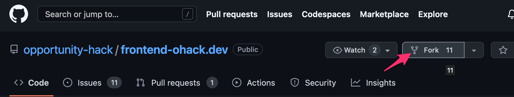
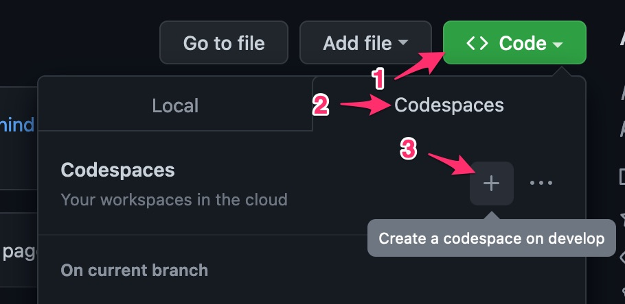

# O-Hack Development Environment Setup
Opportunity Hack site uses NextJS which makes most things pretty easy.
This page provides a couple of things you will still need to do to
get you development environment up and running.

Developers can set up their environments on their local computers or use
Codespaces. We recomend that develoers use VSCode if they choose to 
develop on their local computers. 

## Fork the OHACK repository.
You will need to fork either the 
[frontend-ohack.dev](https://github.com/opportunity-hack/frontend-ohack.dev) 
reositor or 
[backend-ohack.dev](https://github.com/opportunity-hack/backend-ohack.dev) 
repository or both. All pull requests (PR) must be done from your fork. 
All code should be pushed to your private fork. Frome your fork, generate
you PR.

* In your browser, go to the
[frountend-ohack.dev](https://github.com/opportunity-hack/frontend-ohack.dev)
site and click on the **Fork** button.




## IDE Setup
As stated, developers can use either a local (on you local PC) or Codespaces.
There are pros and cons to both. 
| Setup | Pros | Cons |
|:-----:|:----:|:----:|
| Codespaces | All NodeJS is set up.<br>Your VSCode IDE is set up. | Code is remote. <br> You must be online.|
| Local | All your code is local. | You need to set all NodeJS tools.<br>You need to set up your IDE. |

### Codespaces Setup
* In you browser, go to YOUR fork.
* Click on the GREEN code button -> Codespaces tab -> Codespaces "Your workspaces in the cloud" plus link.



* Your Codespaces automatically set up in you browser. You will have a VSCode IDE.

### Local PC Setup
* If you have not done so, install 
[NodeJS](https://nodejs.org/en/). Follow the instructions from the
[NodeJS](https://nodejs.org/en/) page.
* If you have not done so, install
[VSCode](https://code.visualstudio.com/).
* Create a local clone from **YOUR** fork by coping the link on your fork. 
It is recommended that you use the SSH link.
GitHub provides 
[instructions for creating and setting up you public SSH keys](https://docs.github.com/en/authentication/connecting-to-github-with-ssh/adding-a-new-ssh-key-to-your-github-account).


* Create you local clone on your PC using the following command:
```bash
git clone git@github.com:<your_fork>/frontend-ohack.dev.git
```

## Remaining tasks
* Change directory to your local clone on your PC.
* Create and new file in you clone root directory using your IDE called `.env`.
* Add the following lines to the new `.env` file.
* See this
[OHack doc](https://docs.google.com/document/d/1RDJsTLouF3S35mgFZptQv4DZXK0SC6P1mieCinFicDs/edit#bookmark=id.3ha1trc3tfll) to get the values you should add to this `.env` file.

* Install the application depended node modlules.
```bash
npm install
```

* Start the applcation.
```bash
npm run dev

> frontend-ohack-dev@0.1.0 dev /Users/jon/git/frontend-ohack.dev
> next dev

ready - started server on 0.0.0.0:3000, url: http://localhost:3000
info  - Loaded env from /Users/jon/git/frontend-ohack.dev/.env
event - compiled client and server successfully in 5.2s (773 modules)
wait  - compiling /_error (client and server)...
event - compiled client and server successfully in 353 ms (774 modules)
warn  - Fast Refresh had to perform a full reload. Read more: https://nextjs.org/docs/basic-features/fast-refresh#how-it-works
wait  - compiling / (client and server)...
event - compiled client and server successfully in 641 ms (811 modules)
warn  - Fast Refresh had to perform a full reload. Read more: https://nextjs.org/docs/basic-features/fast-refresh#how-it-works

```

You have successfully set up your frontend development environment!

_"May the force be with you!"_
